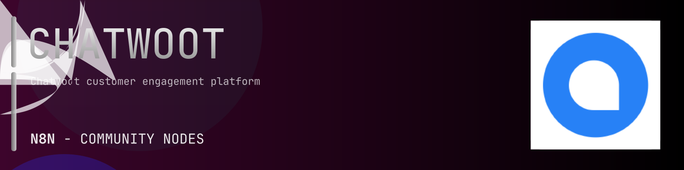

# @n8n-dev/n8n-nodes-chatwoot



[](https://www.npmjs.com/package/@n8n-dev/n8n-nodes-chatwoot)
[](https://opensource.org/licenses/MIT)

---

**Stop writing chatwoot API integrations by hand.**

Every time you connect n8n to chatwoot, you waste hours mapping endpoints, defining parameters, and debugging schemas. You copy-paste from docs, fix edge cases, and pray nothing breaks.

**What if connecting n8n to chatwoot took 5 minutes, not half a day?**

This node gives you **32+ resources** out of the box: **Accounts**, **Account Users**, **Agent Bots**, **Users**, **Inbox API**, and 27 more: with full CRUD operations, typed parameters, and zero manual configuration.

---

## What You Get

- **Zero boilerplate**: Resources, operations, and fields are pre-configured and ready to use
- **Full CRUD**: Create, read, update, and delete support where the API allows it
- **Typed parameters**: No more guessing field types
- **Built-in auth**: API key authentication, ready to go
- **Declarative**: Native n8n performance, no custom execute() overhead

---

## Install

```bash
npm install @n8n-dev/n8n-nodes-chatwoot
```

**Or in n8n:**
1. **Settings → Community Nodes → Install**
2. Search: `@n8n-dev/n8n-nodes-chatwoot`
3. Click **Install**

---

## Quick Start

1. Install the node (above)
2. Add credentials: **chatwoot API** → paste your API key
3. Drag the **chatwoot** node into your workflow
4. Pick a resource → pick an operation → done.

That's it. No configuration files. No code. It just works.

---

## Resources

<details>
<summary><b>Accounts</b> (4 operations)</summary>

- Post Create an Account
- Get an account details
- Patch Update an account
- Delete an Account

</details>

<details>
<summary><b>Account Users</b> (3 operations)</summary>

- Get List all Account Users
- Post Create an Account User
- Delete an Account User

</details>

<details>
<summary><b>Agent Bots</b> (5 operations)</summary>

- Get List all AgentBots
- Post Create an Agent Bot
- Get an agent bot details
- Patch Update an agent bot
- Delete an AgentBot

</details>

<details>
<summary><b>Users</b> (5 operations)</summary>

- Post Create a User
- Get an user details
- Patch Update a user
- Delete a User
- Get User SSO Link

</details>

<details>
<summary><b>Inbox API</b> (1 operations)</summary>

- Get Inbox details

</details>

<details>
<summary><b>Contacts</b> (11 operations)</summary>

- Get List Contacts
- Post Create Contact
- Get Show Contact
- Put Update Contact
- Delete Contact
- Get Contact Conversations
- Get Search Contacts
- Post Contact Filter
- Post Create contact inbox
- Get Contactable Inboxes
- Post Merge Contacts

</details>

<details>
<summary><b>Contact Labels</b> (2 operations)</summary>

- Get List Labels
- Post Add Labels

</details>

<details>
<summary><b>Conversation Assignments</b> (1 operations)</summary>

- Post Assign Conversation

</details>

<details>
<summary><b>Conversations</b> (13 operations)</summary>

- Get Conversation Counts
- Get Conversations List
- Post Create New Conversation
- Post Conversations Filter
- Get Conversation Details
- Patch Update Conversation
- Post Toggle Status
- Post Toggle Priority
- Post Toggle Typing Status
- Post Update Custom Attributes
- Get List Labels
- Post Add Labels
- Get Conversation Reporting Events

</details>

<details>
<summary><b>Custom Filters</b> (5 operations)</summary>

- Get List all custom filters
- Post Create a custom filter
- Get a custom filter details
- Patch Update a custom filter
- Delete a custom filter

</details>

<details>
<summary><b>Inboxes</b> (10 operations)</summary>

- Get List all inboxes
- Post Create an inbox
- Get an inbox
- Patch Update Inbox
- Get Show Inbox Agent Bot
- Post Add or remove agent bot
- Get List Agents in Inbox
- Post Add a New Agent
- Patch Update Agents in Inbox
- Delete Remove an Agent from Inbox

</details>

<details>
<summary><b>Integrations</b> (4 operations)</summary>

- Get List all the Integrations
- Post Create an integration hook
- Patch Update an Integration Hook
- Delete an Integration Hook

</details>

<details>
<summary><b>Labels</b> (5 operations)</summary>

- Get List all labels
- Post Create a label
- Get a label
- Patch Update a label
- Delete a label

</details>

<details>
<summary><b>Messages</b> (3 operations)</summary>

- Get messages
- Post Create New Message
- Delete a message

</details>

<details>
<summary><b>Reports</b> (12 operations)</summary>

- Get Account Reporting Events
- Get Account reports
- Get Account reports summary
- Get Account Conversation Metrics
- Get Agent Conversation Metrics
- Get conversation statistics grouped by channel type
- Get conversation statistics grouped by inbox
- Get conversation statistics grouped by agent
- Get conversation statistics grouped by team
- Get first response time distribution by channel
- Get inbox label matrix report
- Get outgoing messages count grouped by entity

</details>

<details>
<summary><b>Teams</b> (9 operations)</summary>

- Get List all teams
- Post Create a team
- Get a team details
- Patch Update a team
- Delete a team
- Get List Agents in Team
- Post Add a New Agent
- Patch Update Agents in Team
- Delete Remove an Agent from Team

</details>

<details>
<summary><b>Automation Rule</b> (5 operations)</summary>

- Get List all automation rules in an account
- Post Add a new automation rule
- Get a automation rule details
- Patch Update automation rule in Account
- Delete Remove a automation rule from account

</details>

<details>
<summary><b>Help Center</b> (5 operations)</summary>

- Post Add a new portal
- Get List all portals in an account
- Patch Update a portal
- Post Add a new category
- Post Add a new article

</details>

<details>
<summary><b>Contacts API</b> (3 operations)</summary>

- Post Create a contact
- Get a contact
- Patch Update a contact

</details>

<details>
<summary><b>Conversations API</b> (6 operations)</summary>

- Post Create a conversation
- Get List all conversations
- Get a single conversation
- Post Resolve a conversation
- Post Toggle typing status
- Post Update last seen

</details>

<details>
<summary><b>Messages API</b> (3 operations)</summary>

- Post Create a message
- Get List all messages
- Patch Update a message

</details>

<details>
<summary><b>CSAT Survey Page</b> (1 operations)</summary>

- Get CSAT survey page

</details>

<details>
<summary><b>Account</b> (2 operations)</summary>

- Get account details
- Patch Update account

</details>

<details>
<summary><b>Audit Logs</b> (1 operations)</summary>

- Get List Audit Logs in Account

</details>

<details>
<summary><b>Account Agent Bots</b> (5 operations)</summary>

- Get List all AgentBots
- Post Create an Agent Bot
- Get an agent bot details
- Patch Update an agent bot
- Delete an AgentBot

</details>

<details>
<summary><b>Agents</b> (4 operations)</summary>

- Get List Agents in Account
- Post Add a New Agent
- Patch Update Agent in Account
- Delete Remove an Agent from Account

</details>

<details>
<summary><b>Canned Responses</b> (4 operations)</summary>

- Get List all Canned Responses in an Account
- Post Add a New Canned Response
- Patch Update Canned Response in Account
- Delete Remove a Canned Response from Account

</details>

<details>
<summary><b>Custom Attributes</b> (5 operations)</summary>

- Get List all custom attributes in an account
- Post Add a new custom attribute
- Get a custom attribute details
- Patch Update custom attribute in Account
- Delete Remove a custom attribute from account

</details>

<details>
<summary><b>Profile</b> (2 operations)</summary>

- Get Fetch user profile
- Put Update user profile

</details>

<details>
<summary><b>Webhooks</b> (4 operations)</summary>

- Get List all webhooks
- Post Add a WEBHOOK
- Patch Update a WEBHOOK object
- Delete a WEBHOOK

</details>

<details>
<summary><b>Conversation</b> (1 operations)</summary>

- Get messages from a conversation

</details>

---

## Why This Node?

**Without this node:**
- Hours of manual API integration
- Copy-pasting from chatwoot docs
- Debugging auth, pagination, error handling
- Maintaining your own client code

**With this node:**
- Install → configure → use. 5 minutes.
- Auto-generated from the official chatwoot OpenAPI spec
- Always up to date when the API changes
- Native n8n performance

---

## Auto-Generated
This node was auto-generated from the official **chatwoot** OpenAPI specification using
[@n8n-dev/n8n-openapi-node-ultimate](https://github.com/kelvinzer0/n8n-openapi-node-ultimate),
then validated against the live API so you get accurate types and real parameters, not guesswork.

When the chatwoot API updates, this node updates too.

---


## License

MIT © [kelvinzer0](https://github.com/n8n-code)
